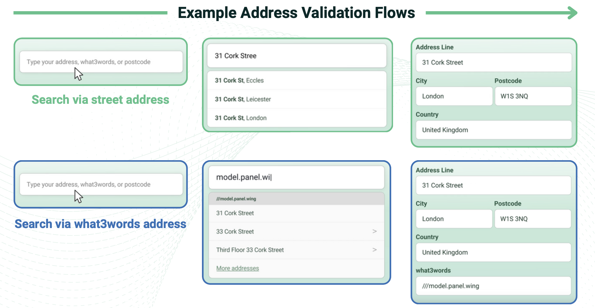

# Swiftcomplete for WooCommerce

The Swiftcomplete Plugin enhances WooCommerce checkout by providing fast and accurate address and what3words autocomplete, improving user experience and reducing delivery errors.

## What is Swiftcomplete?

Swiftcomplete is a software that allows you to look up and validate addresses, postcodes and coordinates. It is designed to be integrated into your address capture flow, for example on e-commerce checkout pages. Swiftcomplete is uniquely designed to return a valid address as fast as possible.

## Why use Swiftcomplete?

Improves quality of address data

- If addresses aren’t checked and validated then there is no guarantee they can be used successfully for deliveries or geolocating.
- Poor addresses = missed or failed deliveries, costing businesses money and creating poor customer experience.

## Easy to set up and run

- 3p per address flat fee - choose pre-paid packs from £10.
- Plugins available for BigCommerce and WooCommerce
- Documentation for API set-up: click [here](https://swiftcomplete.notion.site/Swiftcomplete-Integration-Docs-1a466db17f3b80a18a63dced29d4cfb5?pvs=4)

## Simplify your user experience

- Address validation makes address-entry quicker, easier and less error-prone.
- Swiftcomplete UI is specifically designed to match a customer with their deliverable address as quickly as possible

## Key Features

- Fast: Operates with low latency
- Comprehensive: Combines high quality geospatial databases and multi-residence addresses for best possible address matching.
- Easy to use: Simple, effective user interface
- Cost-effective: 3p per address flat rate (Bespoke enterprise solutions available)
- what3words entry: included as standard

## More about what3words

Find our full developer documentation here:
[https://swiftcomplete.notion.site/Swiftcomplete-WooCommerce-plugin-for-SwiftLookup](https://swiftcomplete.notion.site/Swiftcomplete-WooCommerce-plugin-for-SwiftLookup-1a466db17f3b8018bc4ce65f85f6c852)

You can learn more about our privacy policy here:
[https://www.swiftcomplete.com/privacy/](https://www.swiftcomplete.com/privacy/)

## Versioning

- **Single source of truth:** The plugin version is set in `swiftcomplete/swiftcomplete.php` in two places (WordPress header `Version:` and constant `SWIFTCOMPLETE_VERSION`) and in `swiftcomplete/README.txt` as `Stable tag:`. Keep these in sync.
- **Releases:** Use [semantic versioning](https://semver.org/) (e.g. `2.0.1`). To release:
  1. Bump the version in the plugin file and README.txt (or rely on the release workflow to set it from the tag).
  2. Commit, push, then create and push a tag: `git tag v2.0.1 && git push origin v2.0.1`
- The workflow [release.yaml](.github/workflows/release.yaml) runs on tag push and sets the version in the plugin and readme from the tag; add publish steps (e.g. WordPress.org SVN) there as needed.

## Get in touch with us

Have any questions? Want to learn more about how the Swiftcomplete plugin works? Get in touch with us at [support@swiftcomplete.com](mailto:support@swiftcomplete.com).
